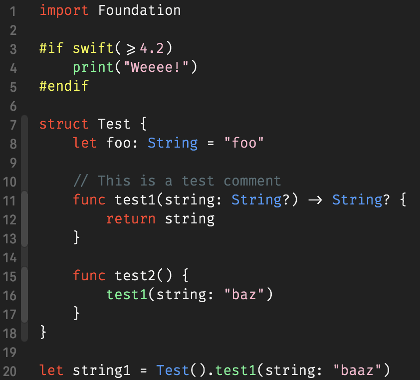

# Xcodejr Theme

My personal theme for Xcode, hope you'll like it as much as I do!

# Installation

First, if you want the most powerful experience, install [FiraCode](https://github.com/tonsky/FiraCode) font.

Then, copy [Xcodejr.xccolortheme](Xcodejr.xccolortheme) theme to `~/Library/Developer/Xcode/UserData/FontAndColorThemes/` directory and restart Xcode. You should have the "Xcodejr" theme in your list of themes in preferences.
